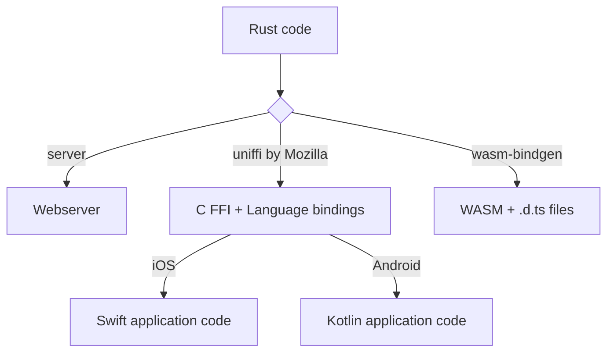

---
# try also 'default' to start simple
theme: seriph
# random image from a curated Unsplash collection by Anthony
# like them? see https://unsplash.com/collections/94734566/slidev
background: https://cover.sli.dev
# some information about your slides (markdown enabled)
title: Welcome to Slidev
info: |
  ## Slidev Starter Template
  Presentation slides for developers.

  Learn more at [Sli.dev](https://sli.dev)
# apply UnoCSS classes to the current slide
class: text-center
# https://sli.dev/features/drawing
drawings:
  persist: false
# slide transition: https://sli.dev/guide/animations.html#slide-transitions
transition: slide-left
# enable Comark Syntax: https://comark.dev/syntax/markdown
comark: true
# duration of the presentation
duration: 35min
---

# Write once, run anywhere

In Rust (und Kotlin)

<div @click="$slidev.nav.next" class="mt-12 py-1" hover:bg="white op-10">
  Meine Erfahrungen mit Rust + Wasm + Uniffi<carbon:arrow-right />
</div>

<div class="abs-br m-6 text-xl">
  <button @click="$slidev.nav.openInEditor()" title="Open in Editor" class="slidev-icon-btn">
    <carbon:edit />
  </button>
  <a href="https://github.com/slidevjs/slidev" target="_blank" class="slidev-icon-btn">
    <carbon:logo-github />
  </a>
</div>

---
transition: slide-up
level: 2
---

# Warum Write Once, Run Everywhere?

- Erfahrungen mit Kotlin Multiplatform (KMP)

<v-click>

## Probleme

<table>
    <tbody>
    <tr v-click="2">
      <th></th>
      <th>Gründe</th>
    </tr>
    <tr v-click="2">
      <td>Große Binaries (500MB)</td>
      <td>Miskonfiguration</td>
    </tr>
    <tr v-click="3">
      <td>Wird nicht optimal ausgeschöpft</td>
      <td>Miskommunikation im Team / Frontend & Backend</td>
    </tr>
    </tbody>
</table>

</v-click>

<br>
<br>
    
- Wenn, dann sollte man all-in gehen! {v-click="4"}

<!--
In einer vorherigen Stelle,
-->

---
transition: fade-out
---

# Warum Rust?

- Hier wirds persönlich... 

<v-click>

- 2019-2020: 📝 Anki Flashcard App

<div class="right">


Mehr über [Anki](https://apps.ankiweb.net/)

</div>

</v-click>

<!-- 
- Übersetzung von Python logik code nach Rust, damit ios und python app dieselbe logik verwenden kann.
- Flashcard Scheduler / Synchronization
- Meine Rolle war aber Frontend Svelte
-->

<style>
.right {
    max-width: 250px;
    float: right;
    text-align: center;
}

.spacer {
    height: 180px;
}

h1 {
  background-color: #2B90B6;
  background-image: linear-gradient(45deg, #4EC5D4 10%, #146b8c 20%);
  background-size: 100%;
  -webkit-background-clip: text;
  -moz-background-clip: text;
  -webkit-text-fill-color: transparent;
  -moz-text-fill-color: transparent;
}
</style>

---

# Wie in Rust (Schlachtplan)

<center v-click>



</center>

<br>

- Language bindings gibt es auch für Python + Ruby {v-click}

---

# Sample app 

- Flashcard App mit Unterstützung für mehrere Sprachen
- Wörter nachschlagen und lokal speichern {v-click}
- Wörter korrekt konjugieren und als "gelernt" markieren {v-click}


<style>
img {
    min-width: 150px;
    float: right;
}
</style>

<br>
<h1 v-click>Ideale Implementation...</h1>

1. Webclient + Deserialization (Write endpoints once) {v-click}
1. Data Structures + Logik wiederverwenden {v-click}
1. Maximale Kolokation {v-click}

<v-click>

4. **Polymorphie überlebt die Sprachbarriere**

</v-click>

<v-click>

5. dadurch.. **Type-Safety**

</v-click>

<!--
Type-safety: das versprechen, dass ich nach einem Refactoring, alle Kompilierfehler fixen kann, und dann funktioniert es wieder
-->

---
transition: fade-in
---

# Webclient implementation (1)

- Zunächst ein generisches "Fetch" interface, welches von der Hostsprache implementiert wird {v-click}

<v-click>

```rust [fetch.rs] {all|1|2|4|5-8|all}
pub trait Fetch {
    type Response;
    
    async fn fetch(&self, url: String) -> Result<Self::Response, FetchError>;
    async fn deserialize_json(
        &self,
        response: Self::Response,
    ) -> Result<Json, SerializeError>;
}
```

</v-click>

---

# Webclient implementation (2)

- Dann implementieren wir für dieses Interface alle Endpunkte {v-click}

<v-click>

```rust [filter-word.rs] {all|1|6-8|9}
impl<F: Fetch> FilterWordBy for F {
    async fn filter_words_by_language<Lang>(
        &mut self,
        language: &Lang,
    ) -> Result<Vec<Word<Lang::PartOfSpeech>>> {
        let response = self
            .fetch(format!("/words/language/{}", language.code()))
            .await?;
        Ok(self.deserialize_json(response).await?)
    }
    
    ...
}
```

</v-click>

- Dadurch kann Server und Client Code nebeneinander leben {v-click}
- Validierung ist inklusive {v-click}

---

# Database client implementation

- Die ähnliche Struktur von Database queries und Web queries können wir uns zunutze machen {v-click}

<v-click>

```rust [filter-word-db.rs] {all|1|2-5|6-9}
impl FilterWordBy for PgConnection {
    async fn filter_words_by_language<Lang>(
        &mut self,
        language: &Lang,
    ) -> Result<Vec<Word<Lang::PartOfSpeech>>> {
        let result = sqlx::query_as("SELECT ... FROM words WHERE ...")
            .fetch_all(self)
            .await?;
        Ok(result)
    }
    ...
}
```

</v-click>

- Kolokation von Webclient & Database fetches die dadurch wiederum ausgelöst werden {v-click}

---

# Ein Rust Struct

```rust [data-structure.rs] {all|1|3-4|all}
pub struct Word<Part: PartOfSpeech> {
    pub dictionary_form: String,
    pub part: Part,
    pub specification: Part::Specification,
    ...
}
```

<br>

- Polymorphie wird mit Generics sicher gestellt {v-click}
- ...Generics sind eine Compile-time Erscheinung {v-click}

<!--
- dictionary_form, könnte auch base form heißen
- part enkodiert die Logic, die Konjugation in diesem Fall
- specification, die Parameter welche für die Logik notwendig sind. Z.b. Irregulariät, abhängig von PartOfSpeech
-->

---

# Problem: Monomorphization (FFI)

- Generics schaffen es nicht auf die andere Seite...  {v-click}
- ...deswegen müssen wir das Struct duplizieren {v-click}

<v-click>

````md magic-move {lines: true}
```rust
pub struct Word<Part: PartOfSpeech> {
    pub dictionary_form: String,
    pub part: Part,
    pub specification: Part::Specification,
    ...
}
```

```rust [ffi-structure.rs]
pub struct Word {
    pub word: String,
    pub part: PartOfSpeechRoot,
    pub specification: JsonValue,
    ...
}
```
````
</v-click>

<v-click>

- Der Polymorphie steckt nun komplett im `PartOfSpeechRoot` Enum
- `specification` muss beim Client erst decoded werden

</v-click>

<!--
Mit vorherigen client als Vorlage
-->

---

- Und in Swift dann...

````md magic-move {lines: true}
```swift [WordView.swift] {all|2-4|7|8|10-11|all}
struct WordView: View {
  let word: String
  let part: PartOfSpeech
  let specification: JsonValue

  var body: some View {
    switch partOfSpeech {
    case let .english(value):
      switch value {
      case .noun: EnglishNounView(value: specification, word: word)
      case .verb: EnglishVerbView(value: specification, word: word)
      default: EmptyParadigmView()
    }
    ...
  }
  ...
}
```

```swift [NounView.swift]
struct EnglishNounView: View {
  let specification: JsonValue
  let word: String

  @State private var model = EnglishNoun()
    .specify(specification: specification)
    .inflect(client: client, word: word)

  var body: some View {
    Grid {
      GridRow {
          Text("singular")
          Text(model.singular)
      }
      GridRow {
          Text("plural")
          Text(model.plural)
      }
    }
}
```
````

---

# Problem: Monomorphization (Wasm)


- Typescript types sind nur eine develop-time {v-click}
- Under-the-hood sind alles PODs

<div v-script>

````md magic-move {lines: true}
```rust {all|2-3,5,7,9-10|1,4,6|all}
#[tsify(type_params = "Part extends PartOfSpeechT")]
pub struct Word<Part: PartOfSpeech> {
    pub word: String,
    #[tsify(type = "Part['Code']")]
    pub part: Part,
    #[tsify(type = "Part['Specification']")]
    pub specification: Part::Specification,
    ...
}
```

```rust 
export type Word<Part extends PartOfSpeechT> = {
    word: string;
    part: Part['Code'];
    specification: Part['Specification'];
};
```
````

</div>

<!--
Keine Duplizierung, aber Annotierung notwendig.
Muss selber schauen, dass meine Annotierung valide ist.
-->

---

- Und was ist mit Typescript...?

````md magic-move {lines: true}
```typescript [my-types.d.ts] {all|3,12|20|4,13|5,14|all}
declare namespace PartOfSpeech {
  export namespace English {
    export type Noun = {
      Code: PartOfSpeechCode.Noun,
      Specification: EnglishNounSpecification,
    };
  }
}

declare namespace PartOfSpeech {
  export namespace English {
    export type Verb = {
      Code: PartOfSpeechCode.Verb,
      Specification: EnglishVerbSpecification,
    };
  }
}

declare namespace PartOfSpeech {
  export type English = PartOfSpeech.English.Noun | PartOfSpeech.English.Verb | ...
}
```

```svelte [WordView.svelte] {all|1|5|6-12|13|16-20|all}
<script lang="ts" generics="Part extends PartOfSpeech.English">
import { type PartOfSpeech, PartOfSpeechCode } from "@lib";
import NounTable from "./NounTable.svelte";
import VerbTable from "./VerbTable.svelte";

type EnglishTableInput = Part
	? {
  		part: Part["Code"],
  		specification: Part["Specification"]
  	}
	: never;

let input: EnglishTableInput = $props();
</script>

{#if input.part === PartOfSpeechCode.Noun}
  <NounTable {...input.specification} />
{:else if input.part === PartOfSpeechCode.Verb}
  <VerbTable {...input.specification} />
{:else}
	...
{/if}
```

```svelte [EnglishNounView.svelte]
<script lang="ts">
import { type EnglishNounSpecification } from "@lib";

const props: EnglishNounSpecification = $props();
const model = await PartOfSpeech.build(props.language, props.part)!
	.specify(props.specification)
	.inflect(fetch, props.word)
</script>

<div>
	<div>
		Singular: {model.singular}
	</div>
	<div>
		Plural: {model.plural}
	</div>
</div>
```
````

<v-click>

- Konvertierung von PODs zu Live Objects in letzter Sekunde passieren

</v-click>

<!--
- Alles manuelle Generierung von Typescript definitionen via Macros (annotierung der Datentypen), in KMP wäre es durch Gradle scripts
- Generisches Svelte component, könnte genauso gut Vue/React sein
-->

---

# Fazit

<v-click>

- Kolokation und Type-Safety von Server + Client Code ist sehr möglich und hilfreich für Menschen und AI

</v-click>

- Garantieren von Type-safety durch FFI erfordert Duplizierung, ist aber simpel {v-click}
- Generieren und korrekte Verwendung von Typescript Bindings erfordert Disziplin {v-click}

# Rust vs KMP

- Letztendlich erfordert beides ähnlich viel Einarbeitung {v-click}
- Rust Macros > Gradle {v-click}

<!--
Sobald FFI kompiliert, ist es korrekt, während WASM, 
-->
