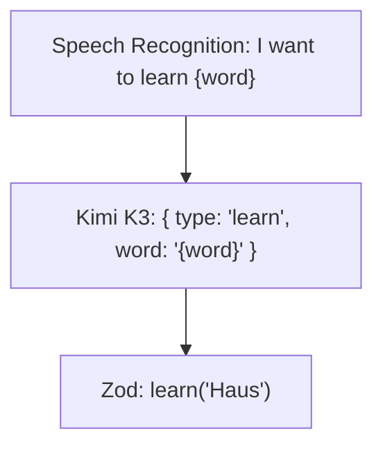

---
# try also 'default' to start simple
theme: seriph
# random image from a curated Unsplash collection by Anthony
# like them? see https://unsplash.com/collections/94734566/slidev
background: https://cover.sli.dev
# some information about your slides (markdown enabled)
title: Welcome to Slidev
info: |
  ## Slidev Starter Template
  Presentation slides for developers.

  Learn more at [Sli.dev](https://sli.dev)
# apply UnoCSS classes to the current slide
class: text-center
# https://sli.dev/features/drawing
drawings:
  persist: false
# slide transition: https://sli.dev/guide/animations.html#slide-transitions
transition: slide-left
# enable Comark Syntax: https://comark.dev/syntax/markdown
comark: true
# duration of the presentation
duration: 15min
---

#  WordList App mit Speech Actions

In React Native

<div @click="$slidev.nav.next" class="mt-12 py-1" hover:bg="white op-10">
    Using Kimi K3
</div>

<div class="mt-12 py-1" hover:bg="white op-10">
  von Henrik Giesel
</div>

<div class="abs-br m-6 text-xl">
  <button @click="$slidev.nav.openInEditor()" title="Open in Editor" class="slidev-icon-btn">
    <carbon:edit />
  </button>
  <a href="https://github.com/slidevjs/slidev" target="_blank" class="slidev-icon-btn">
    <carbon:logo-github />
  </a>
</div>

---
transition: slide-up
level: 2
---

# Requirements

- Lange Liste mit Wörtern (Daten)
- Suchfeld
- Speech Recognition API
- Anbindungen an LLMs für NLP

---
transition: slide-left
---

# Speech actions 

- Als alternative zu Menüs und klassischen Forms

<center>



</center>

---
transition: slide-up
---

# Probleme bei langen Listen

- Anbindung an Firestore API mit 1000+ Einträgen

## Optimierungsansätze

- clientseitig:
  - `FlatList` für virtualisierte Listen
  - `onEndReached` + `onEndReachedThreshold` für Infinite Scroll
  - `React.memo` für unnötige Item-Re-Renders vermeiden
- API-seitig: 
  - Pagination
  - Nur benötigte Daten laden
  - Ergebnisse beim Scrollen anhängen
  
---
transition: slide-up
---

# Speech Recognition API

<div v-click-hide>
- `@react-native-voice/voice` ist deprecated
- Glücklicherweiße können wir auch Expo packages verwenden
</div>

<div-vclick>

```tsx
const handleSpeech = async () => {
  let permission = await ExpoSpeechRecognitionModule.getPermissionsAsync();

  if (!permission.granted) {
    permission = await ExpoSpeechRecognitionModule.requestPermissionsAsync();
  }

  if (!permission.granted) {
    console.warn('Speech recognition permission not granted');
    return;
  }

  ExpoSpeechRecognitionModule.start({
    lang: 'en-US',
    interimResults: true,
    maxAlternatives: 1,
  });
};
```

</div>

---
transition: fade-up
---

- Wir schicken NL zu Server

```tsx
const response = await fetch('https://api.moonshot.ai/v1/chat/completions', {
	method: 'POST',
	headers: { ... }
	body: JSON.stringify({
		messages: [{ role: 'system', content: SYSTEM_PROMPT }, ...messages],
		tools: [...],
		reasoning_effort: 'low',
		response_format: {
			type: 'json_schema',
			json_schema: {
				name: 'Expression',
				strict: true,
				schema: actionSchema,
			},
		},
	}),
});
```

---
transition: fade-out
---

- Zurück in der App

```tsx
setPrompt(transcript);

if (isFinal) {
  setPromptLoading(true);
  
  let value: z.infer<typeof ExpressionSchema> | undefined;

  try {
    value = await chat(transcript);
  } catch (error) {
    console.error('Error', `Something went wrong: ${error}`);
    return;
  }
  
  setPromptLoading(false);

  if (typeof value.type === 'string') {
    if (value.type === 'search') {
      setFilter(value.query);
    } else if (value.type === 'add') {
      add(value.word);
    } else if (value.type === 'review') {
      review(value.word);
    } else if (value.type === 'learn') {
      learn(value.word);
    }
  }
}

setPrompt('');
```

---

<br>
<br>
<br>
    
<center>

# Ergebnis

- Firestore-Daten performant dargestellt
- Spracheingabe integriert
- Natürliche Sprache als App-Steuerung
- LLM liefert typsichere Actions

# Vielen Dank!

</center>
